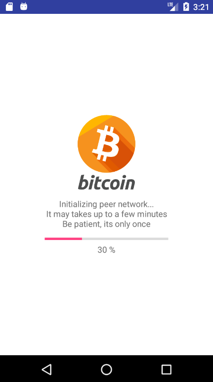
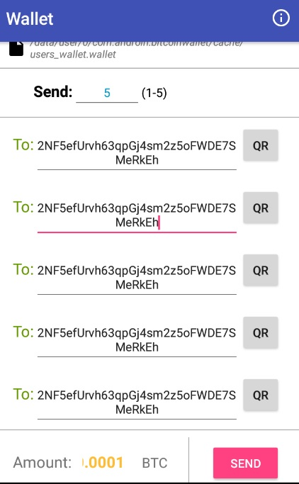

## BitcoinJ Wallet for Android

The application of using the <a href="https://bitcoinj.github.io/">BitcoinJ SDK</a> (MVP architecture).

<b>When you launch application first time it needs to download peer network, it may takes up to 15 minutes, but it happens only once, so be patiant and drink some tea or coffee meanwhile.</b>

# Functionality

Application works with official bitcoin test network (TestNet3) and contains next features: 
* Create wallet
* Get balance
* Receive transactions
* Send multiple transactions
* Get free test bitcoins
* Generating your wallet address QR code
* Scan recipient wallet address QR code

# Screenshots
&nbsp;
&nbsp;

# Service Information
SDK tutorial https://bitcoinj.github.io/getting-started-java

In `build.gradle`:
For BitcoinJ library
```
    dependencies {
        compile 'org.bitcoinj:bitcoinj-core:0.14.7'
    }
```

For retrolambda
```
buildscript {
  repositories {
    maven {
      url "https://plugins.gradle.org/m2/"
    }
  }
  dependencies {
    classpath "gradle.plugin.me.tatarka:gradle-retrolambda:3.7.0"
  }
}

apply plugin: "me.tatarka.retrolambda"
```

Example uses next additinal libraries:
* <a href="https://github.com/androidannotations/androidannotations">Android Annotations</a>
* <a href="https://github.com/kenglxn/QRGen">QRGen</a>
* <a href="https://github.com/zxing/zxing">ZXing</a>

# Reference

It was forked from <a href="https://github.com/thinkmobiles/BitcoinJ-Wallet-Sample-Android">BitcoinJ-Wallet-Sample-Android</a>
